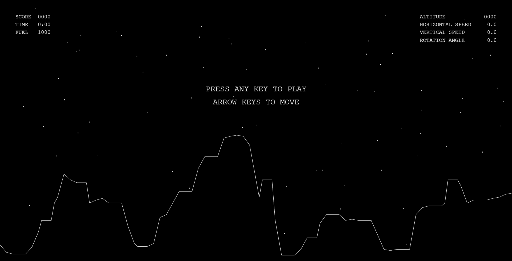
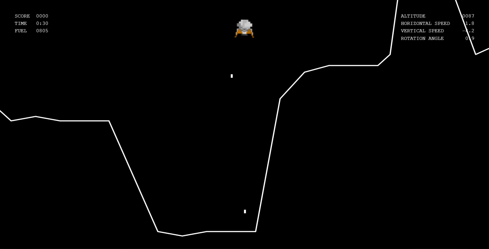
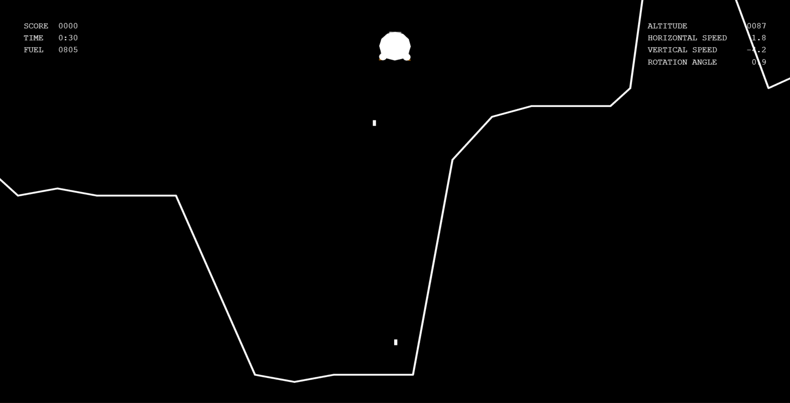
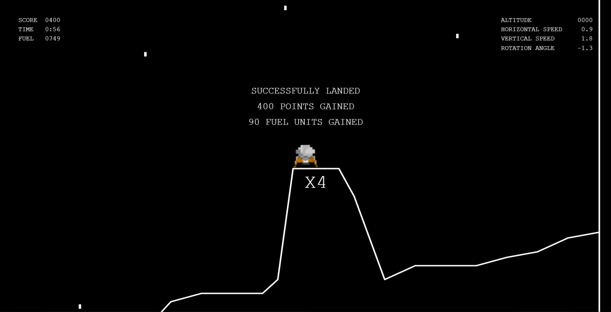
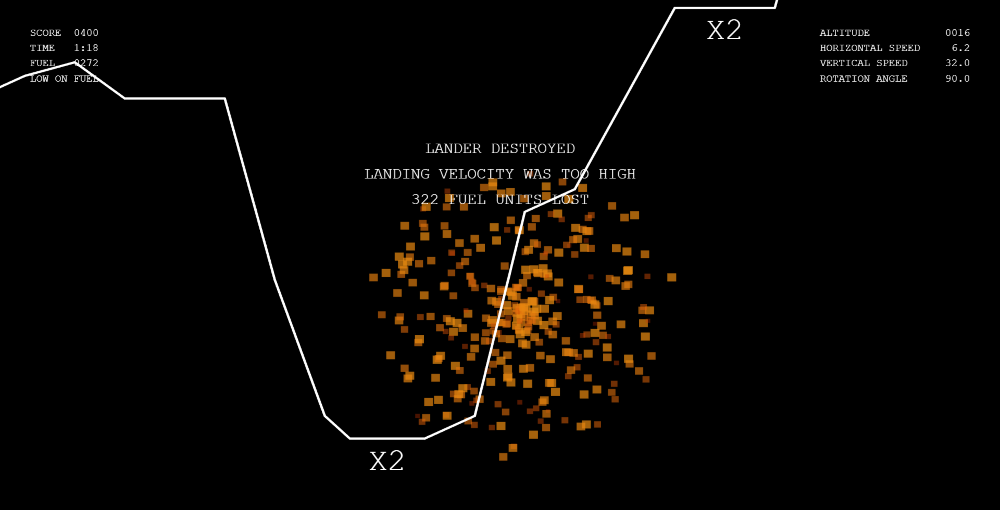

# Moonlander [[play here](https://tblazevic.github.io/moonlander)]

## Gameplay

This game was inspired by [Lunar Lander](https://en.wikipedia.org/wiki/Lunar_Lander_(1979_video_game)).  
The player controls lander rotation and thrusters in order to safely land on the surface.  
The player can land on marked areas to earn extra points and fuel.  
The game goes on until no fuel is remaining.

  

## Technologies used

The game is written in JavaScript and runs entirely on the client side.  
[Threejs](https://github.com/mrdoob/three.js/) is used for rendering and running the game requires a WebGL enabled browser.

## Project architecture

* `constants.js` - game, ui and particle parameters
* `globals.js` - global variables
* `terrainData.js` - terrain points
* `sound.js` - sound effects
* `hud.js` - HUD code
* `particles.js` - particle systems
* `main.js` - main game functionality

## The lander, terrain and camera

The lander itself is a quad with a texture.
Using thrusters does not directly change velocity or acceleration, but [jerk](https://en.wikipedia.org/wiki/Jerk_(physics)), in order to have smoother landings.
Horizontal speed is slightly decreasing to enable strategic decisions regarding fuel consumption.
Vertical speed is only affected by gravity.

The lander is spawned randomly, with a random horizontal speed forcing the player to use some more fuel before attempting to land.

The terrain is defined through an array of points.
Between each pair of points, a quad is positioned, rotated and scaled to connect the two points.

Once the altitude drops below a certain threshold, the camera zooms in and follows the center point between the lander and terrain directly below.
It makes the game less static and helps with landing.

## Collision detection

The shape of the lander is approximated with 3 circles which makes collision detection easier due to rotation.  
Each circle is checked against every line segment defined by the terrain (basic circle-line intersection).

  

Upon collision, the landing is safe if 4 conditions are met:

* velocity magnitude must not be too high
* rotation angle must not be too high
* landing terrain must have a slope of 0
* both landing legs must be grounded

## HUD

The HUD is made with a separate scene and camera which are additively rendered on top of the world scene and world camera.
It contains score and fuel information on the left, lander parameters on the right and some basic information in the middle.
Bonus markings are rendered in world space.

## Particle systems

One particle system is attached to the thruster and it emits particles in a cone.  
The other one creates a circular explosion when the player crashes.

## Audio

Audio is played through the HTML5 audio element.
There are 4 sounds in the game:

* `crash.mp3` - played on crash
* `morse.mp3` - randomly played every x seconds
* `alarm.mp3` - played every x seconds once the next crash means game over
* `rocket.mp3` - looped while using thrusters
